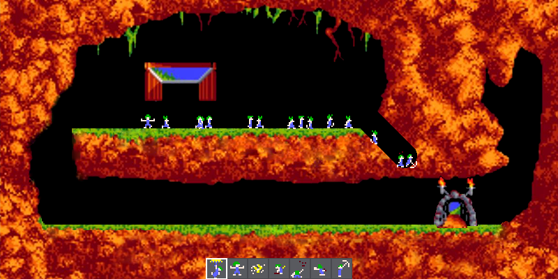
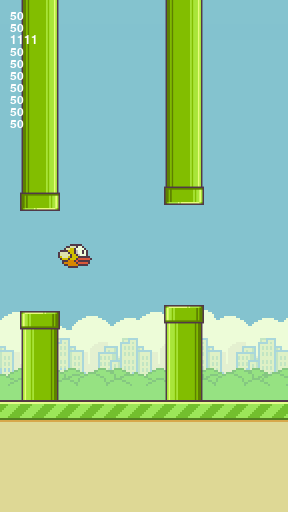
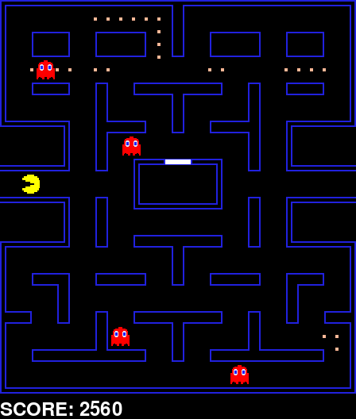

# PR5 Pygame

## Setup

```shell
# Setup virtual environment
$ python -m venv env
$ source env/bin/activate
$ pip install -r requirements.txt
```

## Retro

Retro is a module containing tools shared between this repository's games. Tests and all the games can be run sequentially with `retro/run.sh`.

## Atelier

~~~sh
python -m pong.main
python -m maze.main
python -m shooter.main
python -m lemmings.main
~~~



## Flappy NNGA

~~~sh
python -m flappy.play_manual # play with space bar
python -m flappy.play_auto   # play automatically (simple condition)
python -m flappy.play_nnga   # play automatically (ANN with GA)
~~~



## Pacman NNGA

~~~sh
python -m pacman.play_manual # play with arrow keys
python -m pacman.play_auto # play automatically (heuristic)
python -m pacman.play_nnga # play automatically (ANN with GA)
~~~


